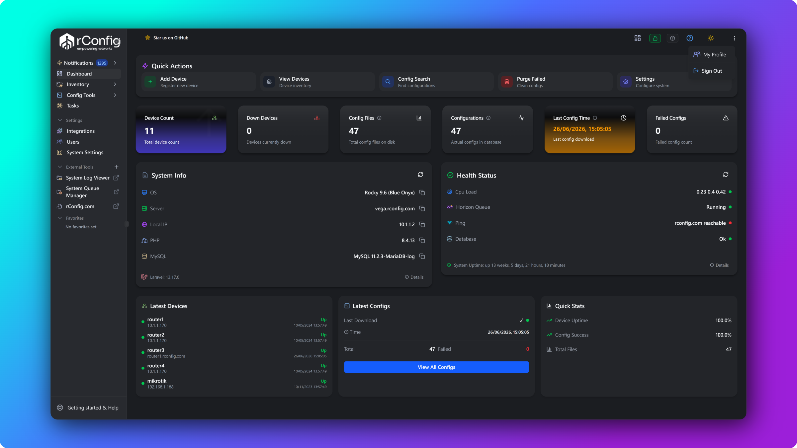

<!-- Improved compatibility of back to top link -->
<a name="readme-top"></a>

<!-- PROJECT LOGO -->
<br />
<div align="center">
  <a href="https://github.com/rconfig/rconfig">
    
  </a>

  <h1 align="center">rConfig v8 Core</h1>

  <p align="center">
    <strong>Enterprise-Grade Network Configuration Management</strong>
    <br />
    Free, Open Source, Community Edition
    <br />
    <br />
    <a href="https://v8coredocs.rconfig.com"><strong>📚 Explore the Docs »</strong></a>
    <br />
    <br />
    <a href="#quick-start">Quick Start</a>
    ·
    <a href="#features">Features</a>
    ·
    <a href="#installation">Installation</a>
    ·
    <a href="https://github.com/rconfig/rconfig/issues">Report Bug</a>
    ·
    <a href="https://github.com/rconfig/rconfig/issues">Request Feature</a>
  </p>

  <!-- Badges -->
  <p align="center">
    <a href="https://github.com/rconfig/rconfig/actions">
      
    </a>
    <a href="LICENSE">
      
    </a>
    <a href="https://github.com/rconfig/rconfig/stargazers">
      
    </a>
  </p>

  <!-- Technology Badges -->
  <p align="center">
    
    
    
    
    
  </p>
</div>

---

## 🎯 About rConfig v8 Core

rConfig v8 Core is a **powerful, free, and open-source** Network Configuration Management (NCM) solution designed to help you easily manage configurations across networks of any size—from small deployments to large, heterogeneous enterprise environments.

### Why Choose rConfig?

- 🚀 **Fast & Efficient** - Optimized for high-performance configuration backups
- 🔒 **Secure** - Built with security best practices from the ground up
- 🌐 **Multi-Vendor Support** - Works with Cisco, Juniper, HP, and more
- 📦 **Easy Deployment** - Docker support for quick setup
- 💰 **Cost-Free** - No licensing fees, truly open source
- 🛠️ **Actively Maintained** - Regular updates and community support

<p align="right">(<a href="#readme-top">⬆ back to top</a>)</p>

---
## 📸 Screenshots

<details>

<summary><strong>Click to view screenshots</strong></summary>

### Dashboard


</details>

## 📘 Documentation

Full V8Core documentation: [https://v8coredocs.rconfig.com/getting-started/](https://v8coredocs.rconfig.com/getting-started/)


## ✨ Features

<table>
<tr>
<td width="50%">

### Core Features
- ✅ **Configuration Backup** - Automated device backups
- ✅ **Multi-Vendor Support** - Cisco, Juniper, HP, Dell, and more
- ✅ **Unlimited Devices** - No artificial limits
- ✅ **Scheduled Tasks** - Automated backup scheduling

</td>
<td width="50%">

### Technical Stack
- 🔧 **Laravel 12** - Modern PHP framework
- 🎨 **Vue.js 3** - Reactive UI components
- ⚡ **Vite** - Lightning-fast builds
- 🎨 **shadcn/ui** - Beautiful UI components
- 🐳 **Docker Ready** - Container deployment
- 📊 **MySQL/MariaDB** - Reliable database

</td>
</tr>
</table>

### 🆚 rConfig Editions Comparison

| Feature              | 🆓 rConfig Core | 💎 rConfig Professional |
|----------------------|:---------------:|:-----------------------:|
| Configuration Backup | ✅              | ✅                      |
| Multi-Vendor Support | ✅              | ✅                      |
| Unlimited Devices    | ✅              | ✅                      |
| API Access           | ❌              | ✅                      |
| Enterprise Features  | ❌              | ✅                      |
| Priority Support     | ❌              | ✅                      |
| SLA Guarantees       | ❌              | ✅                      |

<details>
<summary><strong>📋 View Full Feature Comparison</strong></summary>
<br>
Check out the complete feature list at <a href="https://www.rconfig.com/pricing#full-features">rconfig.com/pricing</a>
</details>

<p align="right">(<a href="#readme-top">⬆ back to top</a>)</p>

---

## 🚀 Quick Start

Get rConfig v8 Core up and running in minutes!

### Option 1: 🐳 Docker (Recommended for Quick Testing)

For Docker installation, please use our dedicated Docker repository:

**👉 [rconfig8coredocker](https://github.com/rconfig/rconfig8coredocker)**

```bash
# install git and docker if you don't have them already
# For CentOS/RHEL/Rocky:
sudo yum install -y git docker docker-compose
sudo systemctl start docker
sudo systemctl enable docker
# For Ubuntu:

sudo apt-get update
sudo apt-get install -y git docker.io docker-compose
sudo systemctl start docker
sudo systemctl enable docker

# Clone the Docker repository
git clone https://github.com/rconfig/rconfig8coredocker.git
cd rconfig8coredocker

## Follow Steps in the official documentation for docker setup: https://v8coredocs.rconfig.com/installation-upgrades/v8-core/docker-setup/

```

To complete the setup, follow the remaining instructions in the V8 Core Docker documentation: [https://v8coredocs.rconfig.com/getting-started/docker-installation/](https://v8coredocs.rconfig.com/installation-upgrades/v8-core/docker-setup/)

**Default credentials:**
- 📧 Email: `admin@domain.com`
- 🔑 Password: `admin`

> ⚠️ **Important:** Change these credentials immediately after first login!

### Option 2: 💻 Native Installation

See the [Full Installation Guide](#installation) below.

<p align="right">(<a href="#readme-top">⬆ back to top</a>)</p>

---

<a id="installation"></a>
## 📦 Installation

For a full VM installation, refer to the documentation at [https://v8coredocs.rconfig.com/getting-started/installation/](https://v8coredocs.rconfig.com/getting-started/installation/) or follow the steps below. Please note, this installation method is more complex and is recommended for experienced users or production environments.

When setting up your VM, we have provided detailed instructions for both CentOS/RHEL/Rocky and Ubuntu. Please follow the steps that correspond to your operating system. and ensure you have the necessary prerequisites installed before proceeding. 

> 💡 **Tip:** We provide automated setup scripts! Visit [v8coredocs.rconfig.com/getting-started/os-configuration/](https://v8coredocs.rconfig.com/getting-started/os-configuration/)

### Prerequisites

OS Requirements: [System Requirements](https://v8coredocs.rconfig.com/getting-started/os-configuration/#system-requirements)

**Supported OS:** Rocky Linux 8/9+ (recommended), CentOS 8/9+, RHEL 8/9+, Ubuntu 22.04+, Alma Linux 8/9+, AWS Linux 2023

**Required Software:** PHP 8.4+, Composer 2.4+, Apache 2.4+, MySQL 5.7+/MariaDB 10.5+, Node.js 14.17+, Git 2.25+, Supervisor 4.2+

---

### 🗄️ Database Setup
```bash
# Login to mariadb/mysql
mysql -u root -p

# Create database
CREATE DATABASE rconfig;

# Create user (recommended for Ubuntu 22.04+)
CREATE USER 'rconfig_user'@'localhost' IDENTIFIED BY 'your_secure_password';
GRANT ALL PRIVILEGES ON rconfig.* TO 'rconfig_user'@'localhost';
FLUSH PRIVILEGES;
EXIT;
```

---

### 📥 Installation Steps
```bash
# 1. Navigate to web directory
cd /var/www/html

# 2. Clone the repository
git clone https://github.com/rconfig/rconfig.git
cd rconfig

# 3. Create environment file
cp .env.example .env

# 4. Edit .env with your settings
nano .env
```

**Update these variables in `.env`:**
```env
APP_URL="https://your-server.domain.com"
APP_DIR_PATH=/var/www/html/rconfig
DB_HOST=localhost
DB_PORT=3306
DB_DATABASE=rconfig
DB_USERNAME=rconfig_user
DB_PASSWORD=your_secure_password
```

> 💡 **Best practice:** Set `APP_URL` to the exact hostname (and scheme) users will browse to, and match it to the Apache `ServerName` further below. This drives absolute URL generation, password reset links, and Sanctum's stateful-domain check. The SPA will still log in if `APP_URL` is left as a placeholder — same-origin requests are accepted automatically — but mail links and OAuth/SAML callbacks will be wrong until you set it correctly.
```bash
# 5. Install PHP dependencies
export COMPOSER_ALLOW_SUPERUSER=1
composer self-update --2
yes | composer install --no-dev

# 6. Setup Apache
chmod +x setup_apache.sh
./setup_apache.sh

# 7. Setup Supervisor
chmod +x setup_supervisor.sh
./setup_supervisor.sh

# 8. Run the beautiful installation wizard, and answer yes to all prompts 🎨
php artisan v8core:install
```

> 🎉 When prompted about cron scheduling, type `yes` and press Enter.

---

### 🔧 Final Configuration
```bash
# Update Apache virtual host to your server's FQDN
# For CentOS/RHEL:
sudo nano /etc/httpd/conf.d/rconfig-vhost.conf

# For Ubuntu:
sudo nano /etc/apache2/sites-enabled/rconfig-vhost.conf
```

Update `ServerName`:
```apache
ServerName your-server.domain.com
ServerAlias your-server.domain.com
```
```bash
# Restart Apache
# CentOS/RHEL:
sudo systemctl restart httpd

# Ubuntu:
sudo systemctl restart apache2

# Set permissions and clear cache
# CentOS/RHEL:
cd /var/www/html/rconfig
chown -R apache storage bootstrap/cache
php artisan rconfig:clear-all

# Ubuntu:
cd /var/www/html/rconfig
chown -R www-data storage bootstrap/cache
php artisan rconfig:clear-all
```

---

### 🔐 SSL / TLS Setup

rConfig should be served over HTTPS in any non-trivial environment. Browser session cookies, SAML/OAuth callbacks, and the SPA's same-origin auth all behave best on a properly certified domain.

For step-by-step instructions covering self-signed certificates, Let's Encrypt, and reverse-proxy termination, see the official guide:

👉 **[SSL Setup Guide → v8coredocs.rconfig.com/auth-security/ssl-setup](https://v8coredocs.rconfig.com/auth-security/ssl-setup/)**

After enabling SSL, make sure your `APP_URL` in `.env` uses `https://` and matches the certificate's hostname.

---

### 🎊 Access Your Installation

Open your browser and navigate to: `https://your-server.domain.com`

**Default System Credentials:**
- 📧 Email: `admin@domain.com`
- 🔑 Password: `admin`

> ⚠️ **Security Notice:** Change or remove these credentials immediately after creating a new admin user!

<p align="right">(<a href="#readme-top">⬆ back to top</a>)</p>
 
---

## 🔄 Updating

> ⚠️ **Before updating:**
> - Backup your database
> - Backup your `.env` file
> - Backup your `storage` directory
> - Backup your entire server if possible

### PHP 8.4 Update (Required as of Feb 2024)
```bash
# For CentOS/RHEL/Rocky:
cd /home
yum -y install wget
wget https://dl.rconfig.com/downloads/php-updates/centos-php8-update.sh -O /home/centos-php8-update.sh
chmod +x centos-php8-update.sh
./centos-php8-update.sh

# For Ubuntu:
cd /home
sudo apt-get install wget
wget https://dl.rconfig.com/downloads/php-updates/ubuntu-php8-update.sh -O /home/ubuntu-php8-update.sh
chmod +x ubuntu-php8-update.sh
./ubuntu-php8-update.sh
```

### Update Commands
```bash
# CentOS/Rocky/RHEL:
cd /var/www/html/rconfig
git pull
php artisan migrate
php artisan rconfig:sync-tasks
composer install
systemctl restart httpd
php artisan rconfig:clear-all

# Ubuntu:
cd /var/www/html/rconfig
git pull
php artisan migrate
php artisan rconfig:sync-tasks
composer install
systemctl restart apache2
php artisan rconfig:clear-all
```

> 💡 **Git Conflicts?** Try: `git stash && git pull`

<p align="right">(<a href="#readme-top">⬆ back to top</a>)</p>

---

## 🤝 Contributing

Contributions make the open-source community amazing! Any contributions you make are **greatly appreciated**.

### Contribution Guidelines

We maintain high standards for code quality and style. Contributors should have:
- Strong working knowledge of PHP, Laravel, and Vue.js
- Understanding of best practices and coding standards
- Ability to write clean, maintainable code

### How to Contribute

1. 🍴 Fork the Project
2. 🌿 Create your Feature Branch (`git checkout -b feature/AmazingFeature`)
3. ✍️ Commit your Changes (`git commit -m 'Add some AmazingFeature'`)
4. 📤 Push to the Branch (`git push origin feature/AmazingFeature`)
5. 🔀 Open a Pull Request to the `develop` branch

### Running Tests
```bash
# 1. Create test database
# 2. Copy environment file
cp .env.example .env.testing

# 3. Generate test key
php artisan key:generate --env=testing

# 4. Update .env.testing
# Set APP_ENV=testing
# Update database credentials

# 5. Run tests
php artisan test
```

### Frontend Development
```bash
# Install dev dependencies
npm install --include=dev

# Start dev server
npm run dev
```

> 💡 **Network issues with npm?** Try: `export NODE_OPTIONS="--dns-result-order=ipv4first"`

<p align="right">(<a href="#readme-top">⬆ back to top</a>)</p>

---

## 📺 Video Tutorials

Check out our YouTube channel for installation walkthroughs and tutorials:

[](https://www.youtube.com/playlist?list=PL8dpV2hQIDLR04p5RuJEVcdhQY1gXKOgU)

<p align="right">(<a href="#readme-top">⬆ back to top</a>)</p>

---

## 📄 License

This codebase is distributed under License from rConfig. See [`LICENSE.txt`](LICENSE.txt) for more information.

> ℹ️ rConfig v8 Professional is excluded from this license and repository.

<p align="right">(<a href="#readme-top">⬆ back to top</a>)</p>

---

## 💬 Support

### Community Support (rConfig Core)

- 🐛 [Report Issues](https://github.com/rconfig/rconfig/issues)
- 💡 [Request Features](https://github.com/rconfig/rconfig/issues/new)
- 📖 [Documentation](https://v8coredocs.rconfig.com)
- ⭐ [Star us on GitHub](https://github.com/rconfig/rconfig)

> ℹ️ rConfig v8 Core is provided on a **best-effort basis**. Response times may vary.

### Priority Support (rConfig Professional)

For business-critical environments and guaranteed response times:
- 🎫 Dedicated support portal
- 📞 Priority response SLA
- 🔧 Expert assistance
- 📊 Advanced features

👉 [Learn more about rConfig Professional](https://www.rconfig.com/)

<p align="right">(<a href="#readme-top">⬆ back to top</a>)</p>

---

## 🙏 Acknowledgments

Built with amazing open-source technologies:

- [Laravel](https://laravel.com) - The PHP Framework for Web Artisans (V12)
- [Vue.js](https://vuejs.org/) - The Progressive JavaScript Framework
- [shadcn/ui](https://ui.shadcn.com/) - Beautifully designed components
- [Vite](https://vitejs.dev/) - Next Generation Frontend Tooling

See [`composer.json`](composer.json) and [`package.json`](package.json) for the complete list of dependencies.

<p align="right">(<a href="#readme-top">⬆ back to top</a>)</p>

---

<div align="center">

### ⭐ Star us on GitHub — it motivates us a lot!

[](https://github.com/rconfig/rconfig/stargazers)

**Made with ❤️ by the rConfig Team**

[Website](https://www.rconfig.com) · [Documentation](https://v8coredocs.rconfig.com) · [Twitter](https://twitter.com/rconfig) · [GitHub](https://github.com/rconfig)

</div>